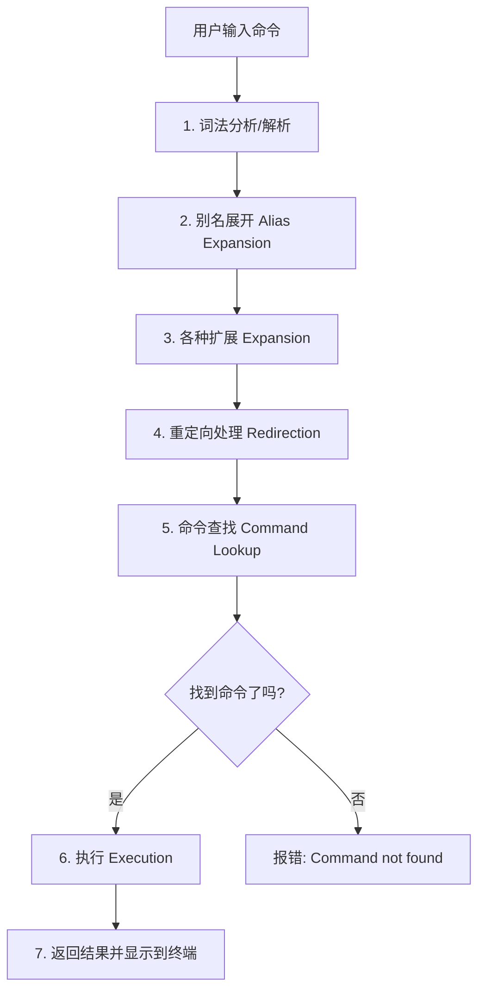

1. more greenhand-friendly, save for lots of terms
2. 

3. shells comparison, terminal bash os relations

4. CLI moved forward
bash syntax and tools

5. bindkey
alias(optional)

6. redirect pipeline illustrations

7. bash is an interpretive language whose interpreter is bash.
shebang
source script file vs execute script file

8. zsh, fish(optional)
